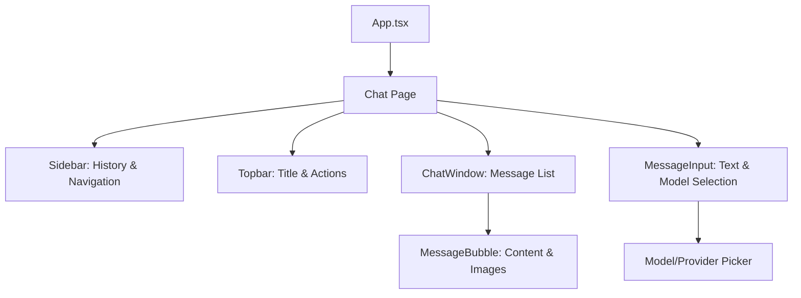

# 🎨 Neural Architect: Frontend Engineering Guide

This document provides a deep dive into the **Universal Chat Frontend**. Built with React, Vite, and Framer Motion, it focuses on providing a high-performance, real-time AI interaction experience with premium aesthetics.

---

## 🚀 Tech Stack

*   **Core**: React 18 + TypeScript
*   **Build Tool**: Vite (Ultra-fast HMR)
*   **Styling**: Vanilla CSS + Tailwind CSS (Utility-first layout)
*   **Animations**: Framer Motion (Smooth layout transitions & micro-animations)
*   **State**: React Hooks (useCallback, useMemo, useRef for performance)
*   **Navigation**: React Router DOM (Single Page Application logic)

---

## 🏗️ UI Architecture

The frontend is organized around a central **Chat Orchestrator** (`src/pages/Chat.tsx`) that manages the lifecycle of AI interactions.

### Component Hierarchy


---

## 🌊 Real-Time Streaming Implementation

The frontend utilizes a custom SSE (Server-Sent Events) handler built on top of the browser's `ReadableStream` API. This is implemented in `src/api/api.ts`.

### 1. The Stream Handler
Unlike standard REST calls, the `sendMessageStream` function maintains an open connection:
```typescript
// Conceptual flow in src/api/api.ts
const reader = response.body.getReader();
const decoder = new TextDecoder();
while (true) {
  const { done, value } = await reader.read();
  if (done) break;
  const chunk = decoder.decode(value);
  // Process SSE formatted chunks (data: {...})
  onChunk(parsed.content);
}
```

### 2. Multi-modal Interception
The frontend actively scans the incoming stream for **Neural Synthesis Markers**. When the backend generates an image, it wraps the metadata in markers which the frontend intercepts *mid-stream*:
- **Start Marker**: `__IMAGE_START__`
- **End Marker**: `__IMAGE_END__`

The `Chat.tsx` component logic extracts these markers, parses the JSON payload (usually a URL), and instantly renders the image module within the message bubble.

---

## ✨ Premium UI Components

### `MessageInput` (`src/components/MessageInput.tsx`)
*   **Model Picker**: A multi-column popover for switching between providers (OpenAI, Anthropic, Gemini) and specific models.
*   **Context Awareness**: Dynamically changes styles (neon glow effects) when an "Image Generation" model is selected.
*   **Micro-animations**: Uses `framer-motion` for the popover scale/fade and input focus rings.

### `MessageBubble` (`src/components/MessageBubble.tsx`)
*   **Role Identification**: Distinct styling for `User` and `Assistant` roles.
*   **Image Gallery**: Includes a responsive image grid that expands when multiple images are generated.
*   **Wait States**: Shows an "Analysing..." pulse while waiting for the first token.

---

## 🛠️ State Management & Persistence

### Local Storage Sync
To provide a seamless experience, the frontend persists several preferences locally:
- `activeChatId`: Restores your last open conversation on refresh.
- `default_model_config`: Remembers your preferred AI model for new chats.
- `chat_model_config_{id}`: Remembers which model you were using for a specific conversation.

### Handling Failures (429s & Retries)
The frontend implements a robust error-catching mechanism. When a **429 (Rate Limit)** or **CORS** error occurs:
1.  The assistant's "thinking" bubble is removed.
2.  The error message is extracted from the backend's `detail` field.
3.  A **Retry Button** is rendered, linking back to the last failed user prompt without losing your typing progress.

---

## 🔌 Backend Integration (Brief)

While the backend repo has its own docs, here is the frontend perspective:
- **Base URL**: Configurable via `VITE_API_BASE_URL` in `.env`.
- **Authentication**: JWT-based. Tokens are stored in `localStorage` and automatically attached to requests via Axios interceptors in `api.ts`.
- **Versioning**: All calls are prefixed with `/api/v1`.

---

## 📸 Interface Preview

### Main Chat Interface


### Neural Synthesis (Image Generation)


### Model Selection & Analytics

